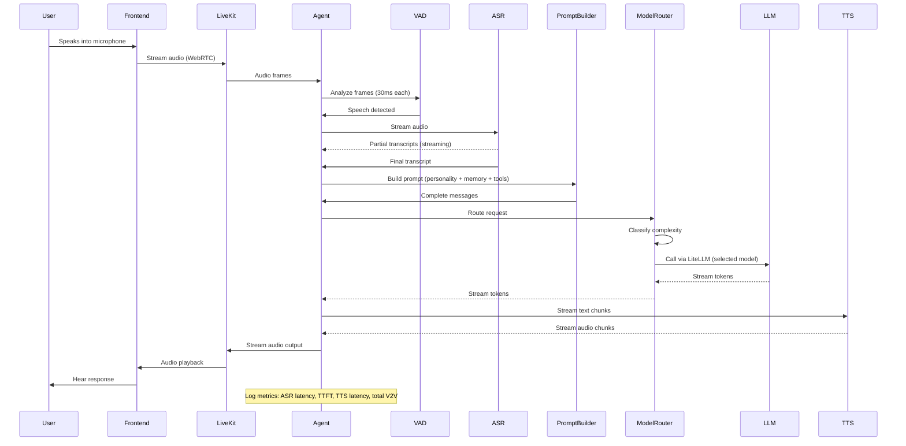
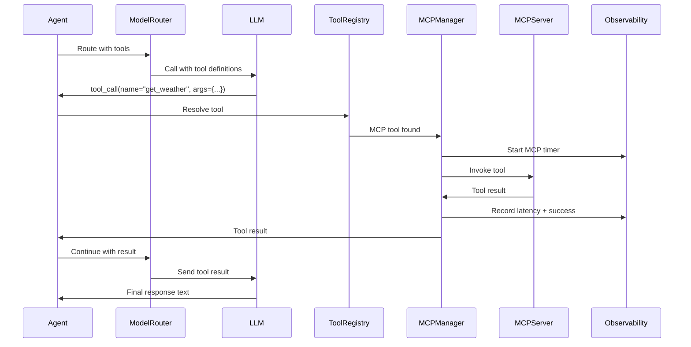
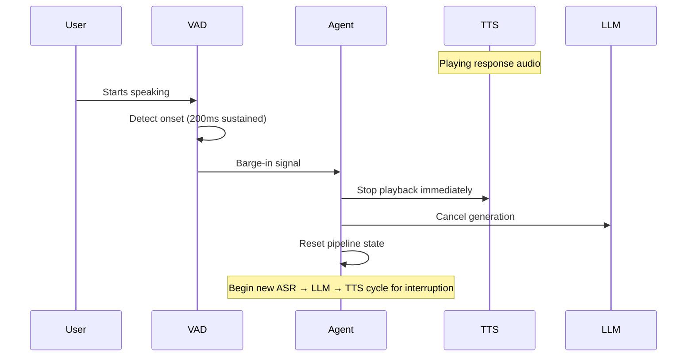
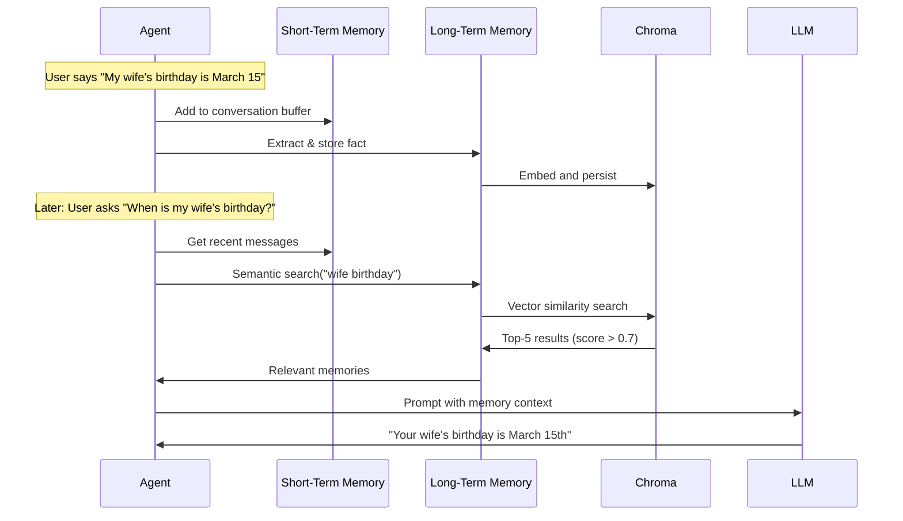

# Design Document

## Overview

EchoMate is architected as a modular, event-driven real-time voice agent built on LiveKit Agents Python. The system follows a pipeline architecture where streaming audio flows through ASR, LLM, and TTS stages with a central orchestrator managing state, tools, memory, and observability. The design prioritizes low latency through streaming at every stage, resilience through fallback chains, and extensibility through MCP and configuration-driven behavior.

## Architecture

```mermaid
graph TB
    subgraph "Frontend (React)"
        UI[LiveKit React Client]
        MIC[Microphone Input]
        SPK[Speaker Output]
        TRANSCRIPT[Transcript Display]
    end

    subgraph "LiveKit Infrastructure"
        LK_SERVER[LiveKit Server]
        LK_ROOM[LiveKit Room]
    end

    subgraph "EchoMate Agent (Python)"
        subgraph "Core Orchestrator"
            AGENT[LiveKit Agent / VoicePipelineAgent]
            TT[Turn-Taking Controller]
            VAD_CTRL[VAD Controller - Silero]
        end

        subgraph "Speech Pipeline"
            ASR[ASR Plugin - Deepgram]
            TTS[TTS Plugin - Cartesia]
            FILLER[Filler Audio Manager]
        end

        subgraph "Intelligence Layer"
            MR[Model Router]
            LLM_ADAPTER[LiteLLM Adapter]
            PROMPT[Prompt Builder]
        end

        subgraph "Tool Layer"
            MCP_MGR[MCP Manager]
            BUILTIN[Built-in Tools]
            TOOL_REG[Tool Registry]
        end

        subgraph "Memory Layer"
            STM[Short-Term Memory]
            LTM[Long-Term Memory / RAG]
            CHROMA[(Chroma Vector DB)]
            SUMMARIZER[Session Summarizer]
        end

        subgraph "Personality"
            PROFILE[Personality Profile]
            PREF_MGR[Preference Manager]
        end

        subgraph "Companion Features"
            BRIEFING[Morning Briefing]
            TASKS[Task Manager]
            REMINDERS[Reminder Scheduler]
            HABITS[Habit Tracker]
            REFLECT[Evening Reflection]
        end

        subgraph "Observability"
            METRICS[Metrics Collector]
            LOGGER[Structured Logger]
            PERF[Performance Tracker]
        end
    end

    subgraph "External MCP Servers"
        MCP_CAL[Calendar MCP Server]
        MCP_WEATHER[Weather MCP Server]
        MCP_SEARCH[Web Search MCP Server]
        MCP_CUSTOM[Custom MCP Servers...]
    end

    subgraph "Free LLM Endpoints"
        NVIDIA[NVIDIA NIM - Nemotron]
        OPENROUTER[OpenRouter Free Models]
    end

    MIC --> UI
    UI <--> LK_SERVER
    LK_SERVER <--> LK_ROOM
    LK_ROOM <--> AGENT
    SPK <-- UI
    TRANSCRIPT <-- UI

    AGENT --> VAD_CTRL
    VAD_CTRL --> TT
    TT --> ASR
    ASR --> PROMPT
    PROMPT --> MR
    MR --> LLM_ADAPTER
    LLM_ADAPTER --> NVIDIA
    LLM_ADAPTER --> OPENROUTER
    MR --> TTS
    TTS --> AGENT
    FILLER --> AGENT

    MR --> TOOL_REG
    TOOL_REG --> MCP_MGR
    TOOL_REG --> BUILTIN
    MCP_MGR --> MCP_CAL
    MCP_MGR --> MCP_WEATHER
    MCP_MGR --> MCP_SEARCH
    MCP_MGR --> MCP_CUSTOM

    PROMPT --> STM
    PROMPT --> LTM
    LTM --> CHROMA
    SUMMARIZER --> LTM

    PROMPT --> PROFILE
    PREF_MGR --> PROFILE
    PREF_MGR --> LTM

    BRIEFING --> TOOL_REG
    BRIEFING --> LTM
    TASKS --> LTM
    REMINDERS --> LTM
    HABITS --> LTM
    REFLECT --> LTM

    AGENT --> METRICS
    MR --> METRICS
    MCP_MGR --> METRICS
    METRICS --> LOGGER
    METRICS --> PERF
```

### Voice Conversation Flow (Happy Path)



### Tool Call Flow (MCP)



### Barge-In Flow



### Memory Flow



### Latency Budget

| Stage | Budget | Strategy |
|-------|--------|----------|
| Audio → ASR start | < 50ms | LiveKit direct streaming |
| ASR processing | < 200ms | Deepgram streaming (interim results) |
| Prompt assembly | < 50ms | In-memory operations |
| LLM time-to-first-token | < 500ms | Fast model routing, streaming |
| TTS first audio chunk | < 200ms | Cartesia streaming |
| **Total voice-to-voice** | **< 1000ms** | All stages streaming |

## Components and Interfaces

### 1. Core Orchestrator (`agent.py`)

The central entry point using LiveKit's `VoicePipelineAgent`. Manages lifecycle, connects all components, and handles room events.

```python
class EchoMateAgent:
    """Main agent orchestrator built on LiveKit VoicePipelineAgent.

    Responsibilities:
    - Initialize LiveKit agent with plugins (ASR, TTS, LLM)
    - Wire up VAD, turn-taking, and barge-in handling
    - Coordinate memory retrieval before LLM calls
    - Dispatch tool calls to MCP Manager or built-in tools
    - Manage session lifecycle (start, active, end → summarize)
    """
    vad: SileroVAD
    asr: DeepgramSTT
    tts: CartesiaTTS
    model_router: ModelRouter
    mcp_manager: MCPManager
    memory: MemoryManager
    personality: PersonalityManager
    metrics: MetricsCollector
    companion: CompanionFeatures

    async def on_room_connected(self, room: Room) -> None:
        """Initialize all components when agent joins a LiveKit room."""

    async def on_user_speech(self, transcript: str) -> None:
        """Handle finalized user speech: build prompt, route, respond."""

    async def on_session_end(self) -> None:
        """Summarize session and persist to long-term memory."""
```

### 2. Model Router (`echomate/model_router.py`)

Intelligent LLM selection with complexity classification and fallback.

```python
class QueryComplexity(Enum):
    SIMPLE = "simple"      # < 20 tokens, greetings, confirmations
    MODERATE = "moderate"  # Standard queries, single-topic
    COMPLEX = "complex"    # Multi-step, analysis, synthesis

class ModelEndpoint(BaseModel):
    name: str                    # e.g., "nvidia_nim/nemotron-4-340b"
    provider: Literal["nvidia_nim", "openrouter_free"]
    model_id: str               # LiteLLM model identifier
    tier: Literal["fast", "reasoning"]
    priority: int               # Lower = higher priority
    avg_latency_ms: float       # Rolling average
    error_rate: float           # Rolling error rate
    tokens_per_second: float    # Rolling throughput

class ModelRouter:
    """Routes LLM requests to optimal free model with fallback.

    Interfaces:
    - classify_complexity(messages) → QueryComplexity
    - route(messages, tools) → AsyncGenerator[str]  (streaming tokens)
    - update_stats(model, latency, success, tokens) → None
    """

    async def classify_complexity(self, messages: list[dict]) -> QueryComplexity:
        """Classify query complexity using token count and heuristics."""

    async def route(self, messages: list[dict], tools: list[dict] | None = None) -> AsyncGenerator[str, None]:
        """Select model, call via LiteLLM, handle fallback on failure.

        Args:
            messages: OpenAI-format message list
            tools: Optional tool definitions for function calling

        Yields:
            Response tokens as they stream from the LLM

        Raises:
            AllModelsFailedError: When all fallback models exhausted
        """

    def update_stats(self, model: str, latency_ms: float, success: bool, tokens: int) -> None:
        """Update rolling performance statistics for routing decisions."""

    def get_available_models(self, tier: str | None = None) -> list[ModelEndpoint]:
        """Get models filtered by tier, sorted by priority and health."""
```

**Free Model Strategy:**

| Provider | Model | Tier | Use Case |
|----------|-------|------|----------|
| NVIDIA NIM | nvidia/nemotron-4-340b-instruct | reasoning | Complex queries, tool calls |
| NVIDIA NIM | nvidia/nemotron-mini-4b-instruct | fast | Simple responses, greetings |
| OpenRouter | meta-llama/llama-3.1-8b-instruct:free | fast | Fallback fast |
| OpenRouter | meta-llama/llama-3.1-70b-instruct:free | reasoning | Fallback reasoning |
| OpenRouter | mistralai/mistral-7b-instruct:free | fast | Last-resort fallback |

**Routing Algorithm:**
1. Classify query complexity (token count, keyword heuristics)
2. Filter models by matching tier (fast/reasoning)
3. Sort by priority, prefer models with lowest recent error rate
4. Attempt top choice via LiteLLM
5. On failure (error or 5s timeout), try next in chain (max 3 fallbacks)
6. Log routing decision and outcome to observability

### 3. MCP Manager (`echomate/mcp_manager.py`)

Manages connections to external MCP servers and exposes their tools.

```python
class MCPServerConfig(BaseModel):
    name: str
    command: str              # Server launch command
    args: list[str] = []
    env: dict[str, str] = {}
    timeout_seconds: int = 15
    enabled: bool = True

class MCPServerState(Enum):
    CONNECTED = "connected"
    DISCONNECTED = "disconnected"
    ERROR = "error"

class MCPManager:
    """Discovers, connects to, and manages MCP servers and tools.

    Interfaces:
    - initialize(servers) → None
    - list_tools() → list[MCPTool]
    - call_tool(name, arguments) → MCPToolResult
    - get_tools_as_openai_functions() → list[dict]
    """

    async def initialize(self, servers: list[MCPServerConfig]) -> None:
        """Connect to all configured MCP servers, discover tools.

        Servers that fail to connect are marked unavailable; others proceed.
        """

    async def list_tools(self) -> list[MCPTool]:
        """Return all available tools across connected servers."""

    async def call_tool(self, tool_name: str, arguments: dict) -> MCPToolResult:
        """Invoke a tool by name, routing to the correct server.

        Args:
            tool_name: The MCP tool name to invoke
            arguments: Tool arguments as a dict

        Returns:
            MCPToolResult with success/error status and data

        Resolution order: first matching server in config order.
        Timeout: 10 seconds per call.
        """

    def get_tools_as_openai_functions(self) -> list[dict]:
        """Convert MCP tools to OpenAI function-calling format for LLM."""

    async def reconnect_server(self, server_name: str) -> bool:
        """Attempt reconnection to a failed server."""

    def get_server_status(self) -> dict[str, MCPServerState]:
        """Return connection status of all configured servers."""
```

**MCP Configuration (mcp_servers.json):**
```json
{
  "servers": [
    {
      "name": "weather",
      "command": "uvx",
      "args": ["weather-mcp-server"],
      "env": {"API_KEY": "${WEATHER_API_KEY}"},
      "enabled": true
    },
    {
      "name": "calendar",
      "command": "uvx",
      "args": ["google-calendar-mcp-server"],
      "env": {"GOOGLE_CREDENTIALS": "${GOOGLE_CREDENTIALS_PATH}"},
      "enabled": true
    },
    {
      "name": "web-search",
      "command": "uvx",
      "args": ["tavily-mcp-server"],
      "env": {"TAVILY_API_KEY": "${TAVILY_API_KEY}"},
      "enabled": true
    }
  ]
}
```

### 4. Memory Manager (`echomate/memory/`)

Two-tier memory with RAG retrieval using LlamaIndex and Chroma.

```python
class MemoryManager:
    """Orchestrates short-term and long-term memory.

    Interfaces:
    - get_context(query) → MemoryContext
    - store_fact(fact, metadata) → None
    - end_session(conversation) → None
    - forget(query) → list[str]
    """
    short_term: ShortTermMemory
    long_term: LongTermMemory

    async def get_context(self, query: str) -> MemoryContext:
        """Retrieve relevant memories for prompt augmentation."""

    async def store_fact(self, fact: str, metadata: dict) -> None:
        """Store a user fact in long-term memory with timestamp."""

    async def end_session(self, conversation: list[dict]) -> None:
        """Summarize and store session in long-term memory."""

    async def forget(self, query: str) -> list[str]:
        """Remove matching entries, return descriptions of removed items."""


class ShortTermMemory:
    """Sliding window conversation buffer with token limit."""
    max_tokens: int = 4000
    messages: list[dict]

    def add(self, message: dict) -> None:
        """Add message and trim if over token budget."""

    def get_messages(self) -> list[dict]:
        """Return current conversation history."""

    def clear(self) -> None:
        """Reset conversation buffer."""


class LongTermMemory:
    """Persistent RAG memory using LlamaIndex + Chroma."""
    index: VectorStoreIndex
    chroma_client: ChromaClient
    collection: Collection

    async def store(self, text: str, metadata: dict) -> None:
        """Embed and persist a memory entry."""

    async def search(self, query: str, top_k: int = 5, min_score: float = 0.7) -> list[MemoryEntry]:
        """Semantic search with minimum similarity threshold."""

    async def delete(self, query: str) -> list[str]:
        """Find and delete matching entries by semantic similarity."""

    def is_available(self) -> bool:
        """Check if Chroma connection is healthy."""
```

### 5. Tool Registry (`echomate/tools/registry.py`)

Unified interface for all tools (MCP + built-in).

```python
class ToolRegistry:
    """Unified tool resolution across MCP and built-in tools.

    Interfaces:
    - get_all_tools() → list[dict]  (OpenAI function format)
    - resolve_and_call(name, args) → ToolResult
    """
    mcp_manager: MCPManager
    builtin_tools: dict[str, Callable]

    def get_all_tools(self) -> list[dict]:
        """Get combined tool definitions for LLM (MCP + built-in)."""

    async def resolve_and_call(self, tool_name: str, arguments: dict) -> ToolResult:
        """Resolve tool to MCP or built-in, execute, return result."""
```

### 6. Personality Manager (`echomate/personality.py`)

```python
class PersonalityProfile(BaseModel):
    tone: Literal["friendly", "professional", "casual"] = "friendly"
    verbosity: Literal["brief", "moderate", "detailed"] = "moderate"
    humor_enabled: bool = True
    formal_address: bool = False
    proactive_suggestions: bool = True
    morning_greeting: GreetingConfig = GreetingConfig()
    evening_greeting: GreetingConfig = GreetingConfig()

class PersonalityManager:
    """Loads, applies, and evolves the personality profile.

    Interfaces:
    - get_system_prompt_fragment() → str
    - update_preference(preference) → None
    """

    def get_system_prompt_fragment(self) -> str:
        """Generate personality instructions for system prompt."""

    async def update_preference(self, preference: str) -> None:
        """Update profile based on user request, persist to memory."""

    def get_verbosity_instruction(self) -> str:
        """Return length constraint for current verbosity level."""
```

### 7. Prompt Builder (`echomate/prompts/builder.py`)

```python
class PromptBuilder:
    """Assembles context-aware prompts for the LLM.

    Interfaces:
    - build_system_prompt(personality, memory, tools, state) → str
    - build_messages(system, short_term, user_input) → list[dict]
    """

    def build_system_prompt(
        self,
        personality: PersonalityProfile,
        memory_context: MemoryContext,
        available_tools: list[dict],
        companion_state: CompanionState,
    ) -> str:
        """Build complete system prompt from all sources."""

    def build_messages(
        self,
        system_prompt: str,
        short_term: list[dict],
        user_input: str,
    ) -> list[dict]:
        """Assemble final message list for LLM call."""
```

### 8. Companion Features (`echomate/companion/`)

```python
class MorningBriefing:
    """Generates personalized morning briefings."""
    async def generate(self, mcp_manager: MCPManager, memory: MemoryManager) -> str:

class TaskManager:
    """CRUD operations for user tasks, stored in memory."""
    async def create_task(self, title: str, due_date: datetime | None) -> Task:
    async def get_pending_tasks(self, within_hours: int = 24) -> list[Task]:
    async def complete_task(self, task_id: str) -> Task:

class ReminderScheduler:
    """Manages reminder creation and delivery."""
    async def create_reminder(self, text: str, trigger_time: datetime) -> Reminder:
    async def check_due_reminders(self) -> list[Reminder]:
    async def queue_missed_reminder(self, reminder: Reminder) -> None:

class HabitTracker:
    """Records and analyzes habit completions."""
    async def record_habit(self, habit_name: str) -> None:
    async def get_trends(self, days: int = 7) -> dict[str, list[datetime]]:

class EveningReflection:
    """Generates end-of-day summaries with improvement suggestions."""
    async def generate(self, tasks: TaskManager, habits: HabitTracker, memory: MemoryManager) -> str:
```

### 9. Observability (`echomate/observability.py`)

```python
class MetricsCollector:
    """Collects and exposes pipeline and component metrics.

    Interfaces:
    - start_request() → str (correlation ID)
    - record_*(request_id, ...) → None
    - complete_request(request_id) → PipelineMetrics
    - get_model_stats() → dict
    - get_mcp_stats() → dict
    """

    def start_request(self) -> str:
        """Generate correlation ID, start timing."""

    def record_asr_latency(self, request_id: str, latency_ms: float) -> None:
    def record_llm_metrics(self, request_id: str, model: str, ttft_ms: float, tokens: int) -> None:
    def record_tts_latency(self, request_id: str, latency_ms: float) -> None:
    def record_mcp_call(self, request_id: str, server: str, tool: str, latency_ms: float, success: bool) -> None:
    def complete_request(self, request_id: str) -> PipelineMetrics:

    def get_model_stats(self, window_seconds: int = 300) -> dict[str, ModelStats]:
        """Rolling stats per model over 5-minute window."""

    def get_mcp_stats(self, window_seconds: int = 300) -> dict[str, MCPServerStats]:
        """Rolling stats per MCP server over 5-minute window."""

    def check_latency_budgets(self, metrics: PipelineMetrics) -> list[str]:
        """Emit warnings for budget violations. Returns list of violations."""


class StructuredLogger:
    """JSON-formatted logger wrapping Python's logging module."""

    def info(self, event: str, **kwargs) -> None:
    def warning(self, event: str, **kwargs) -> None:
    def error(self, event: str, **kwargs) -> None:
    def debug(self, event: str, **kwargs) -> None:
```

### 10. Configuration (`echomate/config/settings.py`)

```python
class ASRConfig(BaseModel):
    provider: Literal["deepgram", "assemblyai"] = "deepgram"
    api_key: str
    model: str = "nova-2"
    language: str = "en"

class TTSConfig(BaseModel):
    provider: Literal["cartesia", "elevenlabs"] = "cartesia"
    api_key: str
    voice_id: str = "default"
    speed: float = 1.0

class LLMConfig(BaseModel):
    nvidia_nim_api_key: str = ""
    openrouter_api_key: str = ""
    default_tier: Literal["fast", "reasoning"] = "fast"
    timeout_seconds: int = 5
    max_fallback_attempts: int = 3

class MemoryConfig(BaseModel):
    chroma_persist_dir: str = "./data/chroma"
    short_term_token_limit: int = 4000
    long_term_top_k: int = 5
    min_similarity_score: float = 0.7

class MCPConfig(BaseModel):
    servers_config_path: str = "./mcp_servers.json"
    connection_timeout: int = 15
    tool_call_timeout: int = 10

class LiveKitConfig(BaseModel):
    url: str
    api_key: str
    api_secret: str

class AppConfig(BaseModel):
    """Root configuration validated at startup. Refuses to start on validation failure."""
    livekit: LiveKitConfig
    asr: ASRConfig
    tts: TTSConfig
    llm: LLMConfig
    memory: MemoryConfig
    mcp: MCPConfig
    personality: PersonalityProfile = PersonalityProfile()
    log_level: Literal["DEBUG", "INFO", "WARNING", "ERROR"] = "INFO"
    silence_threshold_ms: int = 600
```

## Data Models

### Core Data Entities

```python
class MemoryEntry(BaseModel):
    """A single entry in long-term memory."""
    id: str                     # UUID
    text: str                   # The fact/summary content
    category: Literal["fact", "preference", "event", "habit", "session_summary", "task"]
    timestamp: datetime
    metadata: dict              # Additional context (source session, etc.)
    similarity_score: float = 0.0  # Populated on retrieval

class MemoryContext(BaseModel):
    """Combined memory context for prompt augmentation."""
    short_term_messages: list[dict]       # Recent conversation
    long_term_entries: list[MemoryEntry]  # Relevant RAG results
    has_long_term: bool = True            # Whether LTM is available

class Task(BaseModel):
    """A user-created task."""
    id: str                     # UUID
    title: str                  # Max 200 chars
    due_date: datetime | None
    completed: bool = False
    completed_at: datetime | None = None
    created_at: datetime

class Reminder(BaseModel):
    """A scheduled reminder."""
    id: str
    text: str
    trigger_time: datetime
    delivered: bool = False
    queued: bool = False        # Queued for next session start

class HabitEntry(BaseModel):
    """A single habit completion record."""
    habit_name: str
    completed_at: datetime

class PipelineMetrics(BaseModel):
    """Metrics for a single voice pipeline execution."""
    request_id: str
    timestamp: datetime
    asr_latency_ms: float | None = None
    llm_model: str | None = None
    llm_ttft_ms: float | None = None
    llm_tokens: int | None = None
    tts_latency_ms: float | None = None
    total_v2v_ms: float | None = None
    success: bool = True
    error_component: str | None = None
    error_category: str | None = None

class ModelStats(BaseModel):
    """Rolling performance statistics for a single model."""
    model_id: str
    avg_latency_ms: float
    error_rate: float           # 0.0 to 1.0
    tokens_per_second: float
    total_requests: int
    window_start: datetime

class MCPServerStats(BaseModel):
    """Rolling performance statistics for a single MCP server."""
    server_name: str
    avg_latency_ms: float
    error_rate: float
    tool_usage: dict[str, int]  # tool_name → invocation count
    window_start: datetime

class MCPTool(BaseModel):
    """Representation of a discovered MCP tool."""
    name: str
    description: str
    input_schema: dict          # JSON Schema for parameters
    server_name: str            # Which server provides this tool

class MCPToolResult(BaseModel):
    """Result from an MCP tool invocation."""
    success: bool
    data: Any | None = None
    error: str | None = None
    latency_ms: float

class ToolResult(BaseModel):
    """Unified tool result (MCP or built-in)."""
    tool_name: str
    source: Literal["mcp", "builtin"]
    success: bool
    data: Any | None = None
    error: str | None = None

class CompanionState(BaseModel):
    """Current state of companion features for prompt context."""
    is_morning_session: bool = False
    is_evening_session: bool = False
    pending_reminders: list[Reminder] = []
    pending_tasks_count: int = 0
```

### Configuration Data (stored in mcp_servers.json)

```json
{
  "servers": [
    {
      "name": "string",
      "command": "string",
      "args": ["string"],
      "env": {"KEY": "VALUE"},
      "timeout_seconds": 15,
      "enabled": true
    }
  ]
}
```

### Skills Manifest (stored in .agents/skills/skills-manifest.json)

```json
{
  "skills": [
    {
      "name": "livekit-agent-skills",
      "url": "https://github.com/livekit/agent-skills",
      "local_path": ".agents/skills/livekit-agent-skills",
      "last_updated": "2026-06-10T00:00:00Z"
    }
  ]
}
```

## Error Handling

### Pipeline Component Failures

| Component | Failure Mode | Recovery Strategy |
|-----------|-------------|-------------------|
| ASR (Deepgram) | Connection lost / timeout (3s) | Notify user audibly, retry 3x with 2s interval |
| LLM (via LiteLLM) | Error response / timeout (5s) | Fallback to next model in chain (max 3 attempts) |
| TTS (Cartesia) | Connection lost / timeout (3s) | Notify user audibly, retry 3x with 2s interval |
| Chroma DB | Unavailable | Continue with short-term memory only, inform user |
| MCP Server | Connection failed at startup | Mark unavailable, continue with remaining servers |
| MCP Server | Tool call timeout (10s) | Return error to LLM, LLM informs user |
| MCP Server | Disconnected mid-session | Mark unavailable, retry on next tool request to that server |
| All LLM Models | Exhausted fallback chain | Return "no model available" error to pipeline, inform user |
| Config Validation | Invalid .env values | Refuse to start, print specific field and reason |

### Error Propagation

- Component-level errors are caught and wrapped with context (component name, error category)
- All errors include the request correlation ID for tracing
- Errors that affect user experience trigger an audible/visual notification
- Non-critical errors (single MCP server down, memory unavailable) allow degraded operation
- Critical errors (no LLM available, no ASR/TTS connection after retries) stop the pipeline for that request

### Graceful Degradation Priority

1. **Full capability**: All components healthy
2. **Degraded memory**: Chroma unavailable → short-term only, user informed
3. **Degraded tools**: Some MCP servers down → remaining tools + built-ins available
4. **Degraded model**: Primary model failed → fallback model serving (potentially higher latency)
5. **Pipeline failure**: All retries exhausted → inform user, await next input

## Correctness Properties

### Property 1: No data loss on crash
Long-term memories are persisted to Chroma on write; session summaries are stored at session end. Short-term memory is volatile (acceptable loss on crash).

**Validates: Requirements 5.1, 5.5**

### Property 2: Tool call idempotency
MCP tool calls are assumed non-idempotent; retries on timeout are NOT performed (error is returned to LLM instead). The LLM decides whether to retry.

**Validates: Requirements 4.4**

### Property 3: Model routing consistency
Within a single request, if fallback occurs, the same message list is used for the next model attempt (no mutation between retries).

**Validates: Requirements 3.4, 3.5**

### Property 4: Barge-in atomicity
When barge-in occurs, TTS stop + LLM cancel + pipeline reset happen as an atomic sequence before the new utterance is processed.

**Validates: Requirements 2.2, 2.6**

### Property 5: Memory retrieval freshness
Facts stored in the current session are immediately searchable in subsequent queries within the same session.

**Validates: Requirements 5.2, 5.3**

### Property 6: Configuration immutability at runtime
Config is loaded once at startup. Changes require restart. No hot-reload of config during an active session.

**Validates: Requirements 10.6, 10.7**

### Property 7: Metric completeness
Every request that passes through the pipeline produces a metrics entry, whether it succeeds or fails.

**Validates: Requirements 8.1, 8.7**

## Testing Strategy

### Unit Tests

- **Model Router**: Test complexity classification with sample inputs, verify fallback chain ordering, test stats update calculations
- **Memory Manager**: Test store/search/delete operations with mock Chroma, verify token budget trimming, test session summarization
- **MCP Manager**: Test tool resolution priority, test timeout handling, verify tool format conversion
- **Personality Manager**: Test prompt fragment generation for each tone/verbosity combination
- **Prompt Builder**: Test assembled prompts contain expected sections (personality, memory, tools)
- **Observability**: Test metric recording, rolling window calculations, latency budget detection

### Integration Tests

- **Voice Pipeline (mocked audio)**: Verify ASR → LLM → TTS streaming chain produces output
- **MCP Integration**: Start a real MCP server subprocess, verify discovery and tool invocation
- **Memory RAG**: Store facts in Chroma, verify semantic retrieval returns relevant results
- **Model Fallback**: Mock primary model failure, verify fallback model is attempted
- **Barge-in**: Simulate speech detection during TTS, verify pipeline reset

### End-to-End Tests

- **Full conversation**: Simulated audio input → ASR → LLM → TTS → audio output, verify latency < 1000ms
- **Tool call round-trip**: Voice request for weather → MCP tool invoked → spoken response
- **Memory persistence**: Store fact in session 1, retrieve in session 2 (separate agent instances)
- **Frontend connection**: React client connects, sends audio, receives transcript updates

### Performance Tests

- **Latency benchmarks**: Measure V2V latency under controlled conditions, alert if > 1000ms
- **Model router throughput**: Verify routing decision < 10ms overhead
- **Concurrent sessions**: Verify agent handles multiple simultaneous rooms without degradation

## Project Structure

```
echomate/
├── agent.py                    # Main LiveKit agent entry point
├── echomate/
│   ├── __init__.py
│   ├── config/
│   │   ├── __init__.py
│   │   └── settings.py        # Pydantic config models
│   ├── model_router.py        # Smart LLM routing + fallback
│   ├── mcp_manager.py         # MCP server connections + tool dispatch
│   ├── memory/
│   │   ├── __init__.py        # MemoryManager facade
│   │   ├── short_term.py      # Conversation buffer
│   │   └── long_term.py       # LlamaIndex + Chroma RAG
│   ├── personality.py         # Personality profile management
│   ├── prompts/
│   │   ├── __init__.py
│   │   ├── builder.py         # Prompt assembly
│   │   └── templates.py       # System prompt templates
│   ├── companion/
│   │   ├── __init__.py
│   │   ├── briefing.py        # Morning briefing
│   │   ├── tasks.py           # Task management
│   │   ├── reminders.py       # Reminder scheduling
│   │   ├── habits.py          # Habit tracking
│   │   └── reflection.py      # Evening reflection
│   ├── tools/
│   │   ├── __init__.py
│   │   ├── registry.py        # Tool registry (MCP + built-in)
│   │   └── builtin.py         # Built-in tools (timer, math, date)
│   └── observability.py       # Metrics, logging, performance
├── frontend/
│   ├── src/
│   │   ├── App.tsx
│   │   ├── components/
│   │   │   ├── VoiceAgent.tsx
│   │   │   ├── StatusIndicator.tsx
│   │   │   ├── Transcript.tsx
│   │   │   └── ConnectionStatus.tsx
│   │   ├── hooks/
│   │   │   ├── useAgent.ts
│   │   │   └── useTranscript.ts
│   │   └── lib/
│   │       └── livekit.ts
│   ├── package.json
│   └── vite.config.ts
├── mcp_servers.json            # MCP server configuration
├── data/
│   └── chroma/                 # Persistent vector DB storage
├── scripts/
│   ├── setup.sh               # Project initialization + skill cloning
│   └── refresh_skills.sh      # Skill file update
├── .agents/
│   └── skills/
│       ├── skills-manifest.json
│       └── livekit-agent-skills/
├── tests/
│   ├── unit/
│   ├── integration/
│   └── e2e/
├── .env.example
├── pyproject.toml
├── Makefile
└── README.md
```

## Key Technical Decisions

| Decision | Choice | Rationale |
|----------|--------|-----------|
| Agent Framework | LiveKit VoicePipelineAgent | Built-in VAD, audio streaming, WebRTC, plugin arch |
| LLM Abstraction | LiteLLM | Single interface across NVIDIA NIM + OpenRouter |
| Tool Protocol | MCP (subprocess + stdio) | Process isolation, config-only addition, standard protocol |
| RAG Stack | LlamaIndex + Chroma | Well-documented, handles full RAG lifecycle, persistent |
| Configuration | Pydantic + env vars | Validated at startup, clear error messages, type-safe |
| Logging | Python logging + JSON formatter | Standard library, machine-readable, correlation IDs |
| Frontend | LiveKit React SDK + Vite | Official SDK, fast dev, TypeScript |
| MCP Transport | stdio (subprocess) | Isolated, standard, easy to add new servers |

## Security Considerations

- API keys stored only in `.env`, never committed (`.gitignore`)
- MCP servers run in subprocess isolation
- No user audio stored unless explicitly committed to memory
- Memory deletion (`forget`) fully removes vectors from Chroma
- Frontend communicates only via LiveKit's encrypted WebRTC (DTLS-SRTP)
- MCP server environment variables support `${VAR}` expansion from `.env`
