# EchoMate

**EchoMate** is a real-time, voice-powered AI companion and productivity platform. It combines a LiveKit-based Python voice agent with a Next.js spatial UI across four integrated workspaces: voice conversation, AI chat, coding assistant, and career intelligence.

---

## Architecture Overview



---

## Key Features

| Domain | Features |
|--------|----------|
| **Voice** | Real-time speech-to-speech via LiveKit + Deepgram STT + Cartesia TTS; barge-in interrupt; Silero VAD |
| **NVIDIA Voice** | Direct end-to-end speech via `nvidia/nemotron-voicechat` — single API call for audio in / audio + text out |
| **Chat** | Multi-model AI chat with skills, connectors, file attachments, model browser, history |
| **Coding** | Monaco editor, Judge0 CE code execution (8 languages), AI coach with 12 skill modes, Mermaid diagram visualization, LeetCode problem import |
| **Career** | JD parser, resume fit analysis, ATS-optimized LaTeX resume generation, job search, recruiter contact finder, cold email drafter, application tracker |
| **Memory** | Short-term sliding-window context (4000 tokens) + long-term Chroma vector DB with LlamaIndex RAG |
| **Model Router** | Tiered routing (fast / reasoning) with automatic fallback chain across NVIDIA NIM and OpenRouter free models |
| **MCP** | Pluggable Model Context Protocol server support for calendar, weather, web search |

---

## Repository Structure

```
EchoMate/
├── agent.py                    # LiveKit agent entrypoint — voice pipeline orchestrator
├── echomate/                   # Python backend modules
│   ├── config/settings.py      # Pydantic config loaded from .env
│   ├── memory/                 # Short-term + long-term memory (Chroma + LlamaIndex)
│   ├── model_router.py         # Tiered LLM routing with fallback chain (LiteLLM)
│   ├── mcp_manager.py          # MCP server lifecycle + tool registry
│   ├── personality/            # Configurable personality profiles
│   ├── prompts/builder.py      # System prompt assembly
│   └── tools/registry.py       # Tool aggregation (MCP + built-in)
├── app/                        # Next.js 16 frontend
│   ├── app/
│   │   ├── layout.tsx          # Root layout + EmotionContext
│   │   ├── page.tsx            # Renders SpatialDashboard
│   │   └── api/                # Next.js API routes
│   │       ├── voice/chat/     # NVIDIA Nemotron VoiceChat + fallback pipeline
│   │       ├── chat/           # Multi-model text chat
│   │       ├── coding/
│   │       │   ├── coach/      # AI coding coach (12 skill modes)
│   │       │   ├── run/        # Judge0 CE code execution
│   │       │   ├── models/     # Available model listing
│   │       │   ├── tts/        # TTS for coach responses
│   │       │   └── import-url/ # LeetCode problem scraper
│   │       └── career/
│   │           ├── analyze/    # JD + resume fit analysis
│   │           ├── generate/   # LaTeX resume generation
│   │           ├── auto-generate/ # Multi-model batch generation
│   │           ├── email/      # Cold email drafting
│   │           ├── network/    # Recruiter contact search
│   │           ├── jobs/       # Job board search
│   │           ├── tracker/    # Application tracker persistence
│   │           ├── scrape-jd/  # JD URL scraper
│   │           ├── import/     # Resume file import (.tex/.md)
│   │           └── resume-data/ # Master resume CRUD
│   ├── components/
│   │   ├── SpatialDashboard.tsx  # Root layout + view switcher
│   │   ├── voice/              # NvidiaVoiceChat, ConversationBubbles
│   │   ├── coding/             # CodingWorkspace, AICoachPanel, CodeEditorPanel, RunnerPanel
│   │   ├── career/             # CareerWorkspace, JDInputPanel, FitAnalysisPanel, ResumeEditorPanel
│   │   ├── panels/             # TasksPanel, RecapPanel, InsightsPanel, ReadingListPanel
│   │   ├── orb/                # LiquidGlassOrb (animated voice state indicator)
│   │   ├── chat/               # ChatInput, ModelBrowser, SkillsPanel, ConnectorsPanel
│   │   └── ui/                 # StatusBar, GlassCard, AnimatedBorder, SparkLine
│   ├── store/
│   │   ├── careerStore.ts      # Zustand store — career state + all async actions
│   │   ├── chatStore.ts        # Zustand store — chat sessions + history
│   │   └── codingStore.ts      # Zustand store — editor, problems, run results
│   ├── context/
│   │   └── EmotionContext.tsx  # Global emotion state → accent color + animations
│   ├── data/
│   │   ├── resume/master_resume.json   # Persistent master resume
│   │   ├── career_sessions/            # Session history + application tracker
│   │   └── skills_taxonomy.json        # Canonical skills taxonomy
│   └── lib/
│       ├── skillsTaxonomy.ts   # Skill normalization + taxonomy utilities
│       └── codingStats.ts      # Coding session stats helpers
├── .env.example                # All environment variables documented
├── Makefile                    # setup / dev / test / lint targets
└── mcp_servers.json            # MCP server configuration
```

---

## Tech Stack

### Backend (Python Agent)

| Component | Technology |
|-----------|-----------|
| Agent framework | LiveKit Agents v1.x |
| STT | Deepgram (nova-2, 36+ languages) |
| TTS | Deepgram / Cartesia |
| VAD | Silero |
| LLM interface | LiteLLM |
| LLM providers | NVIDIA NIM, OpenRouter (free tier) |
| Memory — short term | In-process sliding window |
| Memory — long term | Chroma vector DB + LlamaIndex RAG |
| Config validation | Pydantic |
| Tool protocol | Model Context Protocol (MCP) |

### Frontend (Next.js App)

| Component | Technology |
|-----------|-----------|
| Framework | Next.js 16, React 19 |
| Styling | Tailwind CSS v4 |
| Animations | Framer Motion, GSAP |
| Code editor | Monaco Editor |
| State management | Zustand (with persistence) |
| Real-time voice | LiveKit Client SDK |
| Markdown rendering | react-markdown + rehype plugins |
| Diagram rendering | Mermaid.js |
| Math rendering | KaTeX |
| Code execution | Judge0 CE (self-hosted) |
| TypeScript | v5 |

---

## Quick Start

See [SETUP.md](SETUP.md) for full installation instructions and [WORKFLOW.md](WORKFLOW.md) for a deep-dive into how each module works.

```bash
# 1. Clone
git clone <repo-url> echomate && cd echomate

# 2. Configure
cp .env.example .env
# Fill in at minimum: LIVEKIT_*, DEEPGRAM_API_KEY, NVIDIA_NIM_API_KEY or OPENROUTER_API_KEY

# 3. Python setup
make setup          # creates .venv, installs deps, clones skill repos

# 4. Frontend
cd app && npm install

# 5. Run everything
make dev-all        # starts token server + Next.js + LiveKit agent in parallel
```

Visit `http://localhost:3000`.

---

## API Keys Required

| Variable | Provider | Free Tier |
|----------|----------|-----------|
| `LIVEKIT_URL` + `LIVEKIT_API_KEY` + `LIVEKIT_API_SECRET` | [LiveKit Cloud](https://cloud.livekit.io) | Yes |
| `DEEPGRAM_API_KEY` | [Deepgram Console](https://console.deepgram.com) | Yes ($200 credit) |
| `NVIDIA_NIM_API_KEY` | [build.nvidia.com](https://build.nvidia.com) | Yes |
| `CARTESIA_API_KEY` | [play.cartesia.ai](https://play.cartesia.ai) | Yes (free credits) |
| `OPENROUTER_API_KEY` | [openrouter.ai/keys](https://openrouter.ai/keys) | Yes (free models) |
| `JUDGE0_BASE_URL` | Self-hosted Judge0 CE | Free (self-hosted) |

At least one of `NVIDIA_NIM_API_KEY` or `OPENROUTER_API_KEY` is required for LLM features.

---

## Model Router

The router classifies query complexity and selects the optimal free model:

| Tier | Model | Use case |
|------|-------|---------|
| `fast` | `nvidia_nim/llama-3.1-nemotron-nano-8b-v1` | Greetings, confirmations, <20-token queries |
| `reasoning` | `openrouter/meta-llama/llama-3.2-3b-instruct:free` | Multi-step, analysis, synthesis |

On error or 5s timeout, the router tries up to 3 fallback models automatically.

---

## Memory Architecture

| Layer | Backend | Scope | Limit |
|-------|---------|-------|-------|
| Short-term | In-memory list | Current session | 4000 tokens |
| Long-term | Chroma + LlamaIndex | Persistent across sessions | Top-5 by similarity (≥0.7) |

Data directory: `./data/chroma/` (configurable via `CHROMA_PERSIST_DIR`).

---

## Development Commands

```bash
make dev          # Start LiveKit agent (dev mode)
make dev-api      # Start token server only
make dev-app      # Start Next.js only (cd app && npm run dev)
make dev-all      # Start all three services
make test         # Python tests (pytest)
make lint         # Ruff linting
make typecheck    # mypy type check
```

---

## Related Documentation

- [WORKFLOW.md](WORKFLOW.md) — Section-by-section system workflow with Mermaid diagrams
- [SETUP.md](SETUP.md) — Full installation guide, requirements, and usage instructions
- [.env.example](.env.example) — All environment variables with descriptions
- [app/CLAUDE.md](app/CLAUDE.md) — Frontend-specific development notes
