# EchoMate — Setup & Usage Guide

This is the complete, authoritative guide for installing, configuring, and using every feature of EchoMate from scratch.

---

## Table of Contents

1. [System Requirements](#1-system-requirements)
2. [API Keys — Where to Get Them](#2-api-keys--where-to-get-them)
3. [Installation](#3-installation)
4. [Environment Configuration](#4-environment-configuration)
5. [Running the Application](#5-running-the-application)
6. [Using Voice Mode — LiveKit](#6-using-voice-mode--livekit)
7. [Using Voice Mode — NVIDIA Direct](#7-using-voice-mode--nvidia-direct)
8. [Using Chat Mode](#8-using-chat-mode)
9. [Using the Coding Workspace](#9-using-the-coding-workspace)
10. [Using the Career Workspace](#10-using-the-career-workspace)
11. [Spatial Dashboard Panels](#11-spatial-dashboard-panels)
12. [Judge0 — Self-Hosted Code Execution](#12-judge0--self-hosted-code-execution)
13. [MCP Server Configuration](#13-mcp-server-configuration)
14. [Memory System](#14-memory-system)
15. [Adding a New LLM Model](#15-adding-a-new-llm-model)
16. [Troubleshooting](#16-troubleshooting)
17. [Development Workflow](#17-development-workflow)
18. [Deployment](#18-deployment)

---

## 1. System Requirements

### Minimum Requirements

| Component | Requirement |
|-----------|------------|
| OS | Windows 10/11, macOS 12+, Ubuntu 20.04+ |
| Python | **3.11 or higher** |
| Node.js | **18 or higher** |
| npm | 9+ |
| Git | Any recent version |
| RAM | 4 GB minimum, 8 GB recommended |
| Network | Broadband (voice streaming requires stable connection) |

### System Dependencies


**macOS:**
```bash
brew install portaudio
```

**Ubuntu/Debian:**
```bash
sudo apt-get install portaudio19-dev python3-dev build-essential
```

**Windows:** No extra steps. Portaudio is bundled in the Python wheels.

---

## 2. API Keys — Where to Get Them

All providers used by EchoMate offer free tiers. You need at minimum the **LiveKit**, **Deepgram**, and one **LLM provider** key.


### Step-by-Step Key Acquisition

#### LiveKit (Required)
1. Go to [https://cloud.livekit.io](https://cloud.livekit.io) and sign up (free)
2. Create a new project
3. Copy: **WebSocket URL** (`wss://...`), **API Key**, **API Secret**
4. Set `LIVEKIT_URL`, `LIVEKIT_API_KEY`, `LIVEKIT_API_SECRET`

#### Deepgram (Required for STT)
1. Go to [https://console.deepgram.com](https://console.deepgram.com) and sign up (free, $200 credit)
2. Create a new API Key
3. Set `DEEPGRAM_API_KEY`

Supported languages via `DEEPGRAM_LANGUAGE`: `en`, `es`, `fr`, `de`, `it`, `pt`, `nl`, `ja`, `ko`, `zh`, `hi`, `ar`, `ru`, `pl`, `tr`, `sv`, `da`, `no`, `fi`, `uk`, `cs`, `el`, `ro`, `hu`, `bg`, `id`, `ms`, `th`, `vi`, `ta`, `te`, `bn`, `mr`, `gu`, `kn`, `ml`, `pa`

#### NVIDIA NIM (Recommended LLM provider)
1. Go to [https://build.nvidia.com](https://build.nvidia.com) and sign up (free tier)
2. Generate an API key
3. Set `NVIDIA_NIM_API_KEY`

This key also enables the NVIDIA Nemotron VoiceChat speech-to-speech endpoint.

#### OpenRouter (Alternative/supplementary LLM)
1. Go to [https://openrouter.ai/keys](https://openrouter.ai/keys) and sign up (free models available)
2. Create an API key
3. Set `OPENROUTER_API_KEY`

#### Cartesia (Optional TTS)
1. Go to [https://play.cartesia.ai](https://play.cartesia.ai) and sign up (free credits)
2. Generate an API key
3. Set `CARTESIA_API_KEY`

---

## 3. Installation


### Step 1 — Clone

```bash
git clone <repo-url> echomate
cd echomate
```

### Step 2 — Python setup

```bash
make setup
```

This script (`scripts/setup.sh`) does the following:
- Creates a `.venv` Python virtual environment
- Installs all Python dependencies from `requirements.txt` / `pyproject.toml`
- Clones LiveKit agent skill repositories into `.agents/skills/`

### Step 3 — Frontend setup

```bash
cd app
npm install
cd ..
```

### Step 4 — Configuration

```bash
cp .env.example .env
```

Edit `.env` — see the [Environment Configuration](#4-environment-configuration) section.

### Verify Python Installation

```bash
.venv/bin/python -c "from echomate.config.settings import AppConfig; print('OK')"
```

Expected output: `OK`

### Verify Agent Startup

```bash
make dev
```

Expected console output on success:
```
EchoMate components initialised successfully
```

If a required API key is missing, you will see a `ValidationError` listing the exact missing fields before the agent starts.

---

## 4. Environment Configuration

Copy `.env.example` to `.env` and fill in values. All variables are listed below.


### Minimal .env for Development

```env
# LiveKit
LIVEKIT_URL=wss://your-project.livekit.cloud
LIVEKIT_API_KEY=APIxxxxxxxxxx
LIVEKIT_API_SECRET=your_secret_here

# Deepgram STT
DEEPGRAM_API_KEY=your_deepgram_key

# LLM — at least one
NVIDIA_NIM_API_KEY=nvapi-xxxxxxxxxxxxxxxxxx
# OPENROUTER_API_KEY=sk-or-xxxxxxxxxxxxxxxx

# Coding execution
JUDGE0_BASE_URL=http://localhost:2358
```

---

## 5. Running the Application

### Development (All Services)

```bash
make dev-all
```

This starts three processes concurrently:
1. **Token server** (`token_server.py`) on port 7880 — issues LiveKit JWT tokens
2. **Next.js** (`app/`) on port 3000
3. **LiveKit agent** (`agent.py dev`) — connects to LiveKit as a worker

Open [http://localhost:3000](http://localhost:3000).

### Individual Services

```bash
# Python LiveKit agent only
make dev

# Token server only
make dev-api

# Next.js frontend only
make dev-app
```

### Service Dependency Map


---

## 6. Using Voice Mode — LiveKit

The LiveKit voice mode creates a full real-time bidirectional audio session through the LiveKit infrastructure.


**Tips:**
- The orb color indicates conversation state (see [Emotion Context](WORKFLOW.md#3-emotion-context-system))
- You can interrupt the agent mid-sentence (barge-in support)
- The silence threshold before response is 600ms (configurable via `SILENCE_THRESHOLD_MS`)
- Supported languages: set `DEEPGRAM_LANGUAGE` in `.env` before starting agent

---

## 7. Using Voice Mode — NVIDIA Direct

The NVIDIA Direct mode bypasses LiveKit and sends audio directly to `nvidia/nemotron-voicechat` in a single API call — no additional infrastructure required.


**Notes:**
- Requires `NVIDIA_NIM_API_KEY`
- Falls back to LLM-only + Chatterbox TTS if the VoiceChat endpoint is unavailable
- This mode does not require the Python agent or token server to be running

---

## 8. Using Chat Mode

Click the **Chat** tab in the top navigation bar.


### Skills System

Skills are reusable prompt prefixes with optional markdown context files:

1. Click **Skills** in the toolbar
2. Click **+** to add a custom skill
3. Enter:
   - **Name**: display label
   - **Prefix**: text prepended to your message
   - **Description**: short label
   - **File**: optional `.md` or `.txt` file — content sent as system context
4. Click **Use** on any skill to apply its prefix to your current input

### Model Browser

Select LLM behavior by tier:

| Tier | Best For |
|------|---------|
| `auto` | Let the system decide |
| `fast` | Quick answers, low latency |
| `reasoning` | Complex analysis, long answers |
| `creative` | Creative writing, brainstorming |
| `technical` | Code, math, technical questions |
| `voice` | Conversational, short responses |
| `image` | Image-related prompts |

You can also select a specific model from the dropdown within each tier.

### File Attachments

- Click the **Attach** button or drag-and-drop
- Multiple files supported
- File names are appended to your message as context
- Supported: any file type (image preview shown for images)

---

## 9. Using the Coding Workspace

Click the **Coding** tab in the top navigation bar.


### Loading a Problem

**Option A — LeetCode URL import:**
1. Paste a LeetCode problem URL into the URL bar at the top
2. Click **Import** — the problem statement, examples, and constraints are auto-extracted

**Option B — Manual entry:**
1. Type or paste the problem statement directly in the Problem panel

### Supported Languages

| Language | Judge0 ID |
|----------|----------|
| Python | 71 |
| JavaScript | 63 |
| TypeScript | 74 |
| Java | 62 |
| C++ | 54 |
| Go | 60 |
| Rust | 73 |
| C# | 51 |

### Running Code


**Note:** For LeetCode-style `Solution` class problems, a driver that parses stdin and calls your method is automatically injected. You do not need to write `main()`.

### AI Coach Actions

Click the **AI Coach** button to open the right panel. Select any of the 12 actions:

| Action | What it does |
|--------|-------------|
| **Explain Problem** | Plain-English restatement, input/output, constraints, common traps |
| **Walkthrough Examples** | Step-by-step table trace through sample inputs |
| **Validate Approach** | Verdict on whether your current code can solve the problem |
| **Give Hint** | One targeted nudge without revealing the solution |
| **Debug Code** | Identify bugs using your code + last run output |
| **Generate Edge Cases** | 6-10 high-value test cases grouped by category |
| **Analyze Complexity** | Time and space Big-O with per-loop breakdown |
| **Optimize Approach** | Identify bottleneck, suggest better algorithm |
| **Dry Run** | Variable-level execution trace in table form |
| **Visualize Flow** | Renders a Mermaid diagram of the algorithm |
| **Show Solution** | Full solution (asks for confirmation first) |
| **Free-form** | Ask anything about the problem in plain text |

The coach always has full context: problem statement + your current code + last run result.

---

## 10. Using the Career Workspace

Click the **Career** tab. The workspace is organized into panels accessible from the left sidebar.


### Setting Up Your Master Resume

Before analyzing jobs, you need a master resume:

**Option A — Use the Form:**
1. Click **Form** in the left sidebar
2. Fill in contact info, summary, experiences, education, skills, projects

**Option B — Import a file:**
1. Click **Import Resume** (accepts `.tex` and `.md` files)
2. The AI extracts structured data and populates your master resume

**Option C — Upload resume files for auto-generation:**
1. Use **Upload Files** to attach `.tex` or `.md` resume files
2. Click **Auto-Generate** — the system scans all files and generates directly from JD + files (no separate analyze step)

### Fit Analysis Panel

After analyzing, you will see:

- **Match Score** — overall fit percentage
- **Matching Skills** — skills found in your resume with evidence snippets
- **Missing Skills** — gaps marked as critical / important / nice-to-have
- **Framing Suggestions** — proposed rewrites for your existing bullets to better match the JD

For each suggestion:
- **Accept** — use the AI's rewrite verbatim in the generated resume
- **Edit** — modify the rewrite before applying
- **Reject** — keep your original bullet

### Resume Generation

Click **Generate Resume** after reviewing suggestions. The generated LaTeX:
- Only includes skills confirmed in your resume (never fabricates)
- Incorporates accepted rewrites verbatim
- Mirrors JD language in bullets where your evidence supports it
- Is ATS-parseable (no images, custom fonts, or multicol layouts)

**ATS Score** is displayed as a gauge (0-97). It reflects how many required/preferred JD skills appear in the output.

Copy or download the `.tex` source and compile with `pdflatex`.

### Network & Email

1. Go to the **Network** panel
2. Company and role are auto-filled from your JD analysis
3. Click **Search Contacts** — returns recruiter and hiring manager profiles
4. Click **Email** next to any contact to generate a personalized cold outreach draft (select tone and purpose)

### Application Tracker

1. From the Resume panel, click **Add to Tracker**
2. The entry is saved to `app/data/career_sessions/tracker.json`
3. View and update status in the **Tracker** panel

---

## 11. Spatial Dashboard Panels

The Spatial view (default) shows a 3-column, 2-row grid around the central voice orb.

| Panel | Location | Description |
|-------|----------|-------------|
| **Tasks** | Top-left | Your task list — click to complete |
| **Insights** | Bottom-left | Activity sparklines and AI-generated insights |
| **Voice Center** | Center | LiquidGlassOrb + ConversationBubbles (LiveKit) or NvidiaVoiceChat |
| **Recap** | Top-right | Completed tasks stream in here |
| **Reading List** | Bottom-right | Curated articles and resources |
| **Status Bar** | Bottom | Connection state + latency metrics |

---

## 12. Judge0 — Self-Hosted Code Execution

Judge0 CE is required for the Coding Workspace. It runs locally via Docker.

### Installation

```bash
# From the project root
cd judge0
docker-compose up -d
```

Wait ~30 seconds for all services to initialize. Verify:

```bash
curl http://localhost:2358/about
```

Expected: JSON with Judge0 version info.

### Environment Variable

```env
JUDGE0_BASE_URL=http://localhost:2358
```

### Alternative — Judge0 RapidAPI (Cloud)

If you cannot run Docker, use the RapidAPI hosted version:

```env
JUDGE0_BASE_URL=https://judge0-ce.p.rapidapi.com
JUDGE0_API_KEY=your_rapidapi_key
JUDGE0_HOST=judge0-ce.p.rapidapi.com
```

---

## 13. MCP Server Configuration

MCP servers extend the voice agent with external tools (weather, calendar, web search).

### Configuration File: `mcp_servers.json`

```json
{
  "servers": [
    {
      "name": "weather",
      "command": "uvx",
      "args": ["mcp-server-weather"],
      "env": {
        "WEATHER_API_KEY": "${WEATHER_API_KEY}"
      }
    },
    {
      "name": "google-calendar",
      "command": "uvx",
      "args": ["mcp-server-google-calendar"],
      "env": {
        "GOOGLE_CREDENTIALS_PATH": "${GOOGLE_CREDENTIALS_PATH}"
      }
    },
    {
      "name": "web-search",
      "command": "uvx",
      "args": ["mcp-server-tavily"],
      "env": {
        "TAVILY_API_KEY": "${TAVILY_API_KEY}"
      }
    }
  ]
}
```

`${VAR}` syntax is expanded from environment variables at runtime.

### Verify MCP Server Connection

On agent startup, check logs for:
```
MCP server 'weather' connected with N tools
```

### Adding a New MCP Server


---

## 14. Memory System

### How It Works

- **Short-term memory**: Automatically maintained per session. No configuration needed.
- **Long-term memory**: Requires Chroma to be available. Data stored in `./data/chroma/` by default.

### Persistence

Long-term memory persists between sessions automatically. To change the storage location:

```env
CHROMA_PERSIST_DIR=/path/to/your/chroma/data
```

### Memory Tuning

```env
SHORT_TERM_TOKEN_LIMIT=4000    # tokens kept in sliding window per session
LONG_TERM_TOP_K=5              # max memories retrieved per query
MIN_SIMILARITY_SCORE=0.7       # minimum cosine similarity for retrieval
```

### What Gets Remembered

The agent extracts and stores:
- Facts you state about yourself
- Preferences you express
- Named events and appointments
- Habit completions
- Session summaries (generated at disconnect)

### Forgetting

Say to the agent: *"Forget that I prefer morning meetings"* — the agent performs a semantic search and removes matching entries, then confirms what was deleted.

---

## 15. Adding a New LLM Model

Edit `echomate/model_router.py`:

```python
from echomate.model_router import ModelEndpoint

# Add to _MODEL_REGISTRY list
ModelEndpoint(
    name="my-model",
    provider="openrouter_free",     # "nvidia_nim" or "openrouter_free"
    model_id="openrouter/org/model-name:free",  # LiteLLM-compatible ID
    tier="reasoning",               # "fast" or "reasoning"
    priority=3,                     # lower number = tried first within tier
)
```

For frontend chat/coding/career models, the model ID must be added to the model picker in `app/components/chat/ModelBrowser.tsx`.

---

## 16. Troubleshooting

### Agent won't start — ValidationError

```
ValidationError: LIVEKIT_URL missing
```

**Fix:** Copy `.env.example` to `.env` and fill in the required fields listed in the error message.

---

### SSL verification errors (corporate proxy / VPN)

```
SSLCertVerificationError
```

**Fix:** Add to `.env`:
```env
SSL_VERIFY=false
```

---

### Voice not connecting — "Failed to get token"


---

### Code execution not working


---

### AI responses not working


---

### Chroma / Memory not persisting

```bash
# Check if chroma directory exists and has data
ls ./data/chroma/
```

If empty after sessions, check that the Python agent connected successfully and `end_session()` was called. Set `LOG_LEVEL=DEBUG` for detailed memory operation logs.

---

### "No AI model configured" message in Coding Workspace

You need at least one of: `NVIDIA_NIM_API_KEY` or `OPENROUTER_API_KEY` in your `.env` file and the Next.js server must be restarted after adding keys.

---

## 17. Development Workflow


### Python Tests

```bash
make test          # runs pytest tests/ -v --tb=short
```

### Frontend Linting

```bash
cd app && npx eslint .
```

### Type Checking

```bash
make typecheck     # mypy on echomate/ + agent.py
```

### Refreshing Skills

```bash
make refresh-skills   # pulls latest from all skill repositories
```

---

## 18. Deployment

### Python Agent (Production)

```bash
python agent.py start
```

Use a process manager to keep it running:

**systemd:**
```ini
[Unit]
Description=EchoMate Voice Agent
After=network.target

[Service]
WorkingDirectory=/path/to/echomate
ExecStart=/path/to/echomate/.venv/bin/python agent.py start
EnvironmentFile=/path/to/echomate/.env
Restart=always
RestartSec=5

[Install]
WantedBy=multi-user.target
```

**PM2:**
```bash
pm2 start agent.py --interpreter .venv/bin/python --name echomate -- start
```

### Next.js Frontend (Production)

```bash
cd app
npm run build
npm run start       # starts on port 3000
```

Or deploy to Vercel / Railway / any Node.js host. Set all environment variables in the host's dashboard.

### Required Production Environment Variables

```
LIVEKIT_URL
LIVEKIT_API_KEY
LIVEKIT_API_SECRET
DEEPGRAM_API_KEY
NVIDIA_NIM_API_KEY   (or OPENROUTER_API_KEY)
JUDGE0_BASE_URL      (self-hosted Judge0 address)
```

### Judge0 CE Production

```bash
cd judge0
docker-compose -f docker-compose.yml up -d
```

Ensure the host running Judge0 is accessible from the Next.js server at `JUDGE0_BASE_URL`.

---

*For architecture and workflow details, see [WORKFLOW.md](WORKFLOW.md). For API reference, see the route files under `app/app/api/`.*
